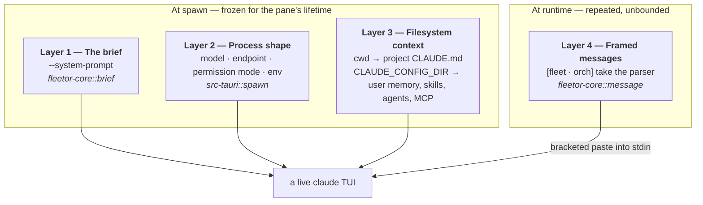

# What a pane is told — the context map

The companion to [`fleet-comms-map.md`](./fleet-comms-map.md). That one follows a *message* from the model that typed it to the terminal it lands in. This one answers a different question: **when a pane starts, what is in its head, and who decided that?**

Written as the survey before context customization (branch `feat/context-management`). It documents what the code does today, names every place a decision is currently frozen into a Rust constant, and marks which of those are safe to hand to an operator.

---

## 1. The system in one paragraph

FLEETOR runs **five live `claude` terminals** side by side in a Tauri app: one orchestrator (`orch`) and four workers (`worker-1..4`). They are peers, not subagents — each is a real interactive TUI in its own pty, with its own context window and its own checkout of the repo. They coordinate by typing into each other: a `fleet send` from one pane's Bash tool crosses a unix socket to the app, which pastes a framed line straight into the target pane's input box. Nothing queues, nothing polls, and no agent can see another's screen. The operator can see all five.

That design has one consequence that drives this entire document: **a pane is configured exactly once, at spawn.** There is no per-turn context assembly, no retrieval step, no system-prompt refresh. Whatever the pane is told at `exec` time is what it believes for its whole life. Everything after that is messages typed into a text field.

---

## 2. The four layers of context

Every pane's understanding of the world comes from four distinct sources. They are worth separating because they have completely different owners, blast radii, and customization stories.



### Layer 1 — The brief (`prompts/*.md`, rendered by `crates/fleetor-core/src/brief.rs`)

The only thing that tells a `claude` it is part of a fleet. Two templates, `prompts/orch.md` and `prompts/worker.md`, rendered by `orch_brief(roster, cwd)` and `worker_brief(me, roster, cwd)` and passed via `--system-prompt` — which *replaces* Claude Code's own system prompt rather than appending to it (D-043).

> When this survey was taken the prose lived in two `format!` literals in `brief.rs`, and §4 below is the argument for getting it out of there. That argument was made and won — D-042. The rendered briefs did not change a byte; where they come from did. `brief.rs` is now the renderer and the validator, and `prompts/README.md` is the account of the files.

Deliberately **not** a `CLAUDE.md` written into the pane's cwd — that would show up in the worker's own `git status`, and the worker could delete the file that tells it how to behave.

Both briefs carry:
- who else exists (`peer_list` — the roster minus yourself, in prose)
- every `fleet` verb, with examples — the list is `brief::VERBS` (nine of them as of D-064), and a brief that omits one is refused rather than rendered
- `delivery-contract.md` — composed into both at `{delivery_contract}`, the paragraph explaining that non-zero exit means *not delivered*
- the two framings a message can arrive in, so the receiver can tell a direct message from a broadcast

The **orch brief** adds: delegate rather than do it yourself, tell workers what the others have, answer their questions. The **worker brief** adds the L5 anti-amplification clause — *never reply to a broadcast unless it names you* — which is the only thing standing between the fleet and a token fire where five helpful peers answer each other forever.

### Layer 2 — Process shape (`src-tauri/src/spawn.rs`)

Two deliberately different postures.

| | `orch` | `worker-N` |
|---|---|---|
| Model | operator's own (Opus) | `deepseek-v4-flash` |
| Endpoint | operator's login | `https://api.deepseek.com/anthropic` |
| Credential | whatever they use | `DEEPSEEK_API_KEY` → `ANTHROPIC_AUTH_TOKEN` |
| Permission mode | operator's default | `--permission-mode auto` |
| `CLAUDE_CONFIG_DIR` | `~/.fleetor/_shell/pane-config/orch` (D-062) | `~/.fleetor/_shell/pane-config/worker-N` |
| Credential lookup | `CLAUDE_SECURESTORAGE_CONFIG_DIR=""` → the operator's own Keychain entry | n/a — `ANTHROPIC_AUTH_TOKEN` |
| cwd | the target repo | `~/.fleetor/_shell/worktrees/worker-N` (branch `fleet/worker-N`) |

Both get `FLEETOR_PANE` (identity — there is no anonymous connection), `FLEET_SOCKET`, an augmented `PATH` that can find `claude` and `fleet`, and a truecolor `TERM`.

Three of these are load-bearing in the "silently wedges the pane forever" sense, all bisected in Phase 0: `ANTHROPIC_API_KEY` must be **unset** (interactive `claude` blocks on an approval prompt it never gets past), `--permission-mode auto` (the default `manual` wedges on the first tool call), and the config-dir seed below.

WP-14 added a fourth, and it is the quietest of them: **`CLAUDE_SECURESTORAGE_CONFIG_DIR` must be set to the empty string wherever `CLAUDE_CONFIG_DIR` is set for `orch`.** `claude` hashes the config dir into its macOS Keychain service name, so a fleet-owned directory is a fresh, empty login — the pane reaches its input box, every `fleet send` reports `accepted`, and only its turns fail. `docs/notes/orch-config-dir-notes.md` measures it at CC 2.1.224.

### Layer 3 — Filesystem context (the invisible layer)

This is the one nobody wrote down, and it is where the biggest asymmetry lives.

Every pane's `CLAUDE_CONFIG_DIR` is a private directory that `seed_config_dir` creates and puts **exactly two things in**: `hasCompletedOnboarding`, and per-project `hasTrustDialogAccepted` / `hasCompletedProjectOnboarding`. That is all. Which means:

> **No pane inherits the operator's Claude Code setup — `orch` included, since D-062.** No user `CLAUDE.md`, no skills, no subagents, no MCP servers, no settings, no hooks, no permission allowlist. `orch` inherited all of it until WP-14 moved it onto a fleet-owned config dir so its transcript could be archived with the run; that inheritance was the price.

What every pane *does* get is the **project** context, because its cwd is the target repo or a git worktree of it — so a `CLAUDE.md` committed in the repo loads normally, as does anything in the repo's `.claude/`.

So the context ladder is now the same shape for both classes: bare Claude + repo's own files + fleet brief, with `orch` differing in its model, its login, its `HOME` and its permission posture rather than in what it reads off disk. The operator can populate `~/.fleetor/_shell/pane-config/orch/` themselves — nothing else writes there — which is the opt-in-to-something-in-between this section used to say did not exist.

### Layer 4 — Framed messages (`crates/fleetor-core/src/message.rs`)

At runtime a pane receives exactly one kind of input from the fleet: a line typed into its input box.

```
[fleet · orch] take the parser, I have the CLI
[fleet · worker-1 → all] rebasing onto master
```

Single-sourced in `message.rs` so the delivery path cannot invent a second spelling, and cross-checked by a test in `brief.rs` so the briefs cannot describe a framing that no longer exists. `sanitize` strips control characters here — a security boundary, not tidying: a body containing `ESC[201~` would end the bracketed paste early and turn its own tail into live keystrokes at a `claude` prompt.

---

## 3. Where every decision currently lives

*Updated for D-042 — the prose and launch settings moved out of Rust into `prompts/`. See [`prompts/README.md`](../prompts/README.md) and [`context-injection-flow.md`](./context-injection-flow.md).*

| Decision | Where it lives | Form | Operator-editable? |
|---|---|---|---|
| Target repo | `~/.fleetor/config.json` → `"target"` | JSON | ✅ via folder picker |
| Orchestrator brief | `prompts/orch.md` | markdown template | ✅ `~/.fleetor/prompts/` |
| Worker brief | `prompts/worker.md` | markdown template | ✅ `~/.fleetor/prompts/` |
| Delivery contract | `prompts/delivery-contract.md` | markdown fragment | ✅ — placeholder required |
| L5 anti-amplification clause | `prompts/broadcast-rule.md` | markdown fragment | ✅ — placeholder required |
| Worker model | `prompts/launch.conf` → `[worker] model` | conf | ✅ `~/.fleetor/prompts/` |
| Worker endpoint | `prompts/launch.conf` → `[worker] base_url` | conf | ✅ `~/.fleetor/prompts/` |
| Worker permission mode | `prompts/launch.conf` → `[worker] permission_mode` | conf | ✅ `~/.fleetor/prompts/` |
| Fleet size | `pane.rs::WORKER_SLOTS = [1,2,3,4]` | `const [u8; 4]` | ❌ recompile (mirrored again in `ui/src/fleet/types.ts`) |
| Worker config-dir contents | `spawn.rs::seed_config_dir` | two hardcoded keys | ❌ recompile |
| Worker cwd strategy | `fleet.rs::ensure_worktree` | worktree-or-fallback | ❌ recompile |
| Message framing | `message.rs::frame_*` | `format!` literal | ❌ single-sourced on purpose |
| The three wedge-forever env removals | `spawn.rs` | `env_remove` | ❌ documented in `launch.conf` |

`config.json` is read by exactly one function (`configured_target`) which pulls exactly one key. Notably it does not exist on a fresh machine — first run falls back to a seeded testbed with a notice.

What has **not** changed: there is still **no per-pane differentiation among workers**. All four render the same `worker.md`, differing only in `{me}` and `{peers}`. There is no way to say "worker-1 is the test writer, worker-2 owns the frontend" — that is the next step, and the template seam is now the place to add it.

---

## 4. What this means for a customization system

### The shape of the opportunity

Three distinct user needs are tangled together in "customize what context is injected":

1. **Role specialization** — give worker-2 a different job description than worker-3. Highest value, currently impossible, and it is the thing that makes a fleet more than four copies of the same agent.
2. **Environment parity** — let workers see some of the operator's setup (a shared house-style `CLAUDE.md`, a specific skill, an MCP server) without inheriting all of it. Currently all-or-nothing at the config-dir boundary.
3. **Brief tuning** — edit the coordination prompt itself. `decisions.md` D-031 flags that the briefs are *unvalidated against a real Flash worker*, so this is a live need: a Flash worker may well need blunter instructions than the text written for Opus.

### The hard constraint

Parts of the brief are safety-critical and must not be user-deletable:

- **`DELIVERY_CONTRACT`** — the model reads its own Bash exit code and self-corrects. Delete this and a pane silently believes every send arrived.
- **The L5 clause** — the only mitigation for broadcast amplification. D-031 records that the *code-level* rate limiter was deliberately removed on operator direction, on the grounds that nothing in the delivery path may be able to refuse a message. That decision is only safe while the prompt-level mitigation holds.
- **The framing description** — a worker can only obey L5 if the brief describes the framing it actually sees. `brief.rs` has a test that cross-checks this against `message.rs`.
- **The verb list** — `VERBS` is pinned to the clap subcommands by a test, and the briefs are asserted against hard-coded literals *on purpose*, so a rename can't leave a brief teaching a verb that exits 2.

So the design cannot be "hand the operator a text box containing the brief." It has to be a **fixed kernel plus an operator overlay**: the fleet-mechanics half stays compiled and tested, and the role/behavior half becomes editable. Whatever ships should keep every existing `brief.rs` test passing against the *composed* output, not just the kernel.

### The natural seam

Everything above funnels through two functions, which is unusually clean:

- `brief::orch_brief` / `brief::worker_brief` — called from exactly one place each, in `spawn.rs`
- `spawn::orch_command` / `spawn::worker_command` — called from exactly one place each, in `fleet.rs::spawn_pane`

A context profile resolved once at bootstrap (next to `resolve_target`, which already has the announce-on-the-feed pattern) and threaded into those two call sites covers the whole surface. `config.json` already has a merge-not-clobber writer (`merge_target`) to extend, and `~/.fleetor/` is already the operator-facing root that `rm -rf` fully undoes.

### Open questions for the design pass

- **Per-worker or per-role?** Four named slots with individual overlays, or a small set of role templates a slot is assigned to?
- **Where does the overlay live** — more keys in `config.json`, or a `~/.fleetor/context/` directory of markdown files the operator can edit in their own editor? (Markdown files are much nicer to write a role brief in; JSON is nicer to validate.)
- **Does the orchestrator's overlay reach the workers?** i.e. can the operator write "this fleet is working on the payments migration" once, and have it appear in all five briefs?
- **What happens to a running fleet when the overlay changes?** Precedent is set: `fleet_pick_target` deliberately does *not* move a running fleet, and announces that the change takes effect next launch. Briefs should almost certainly follow the same rule — a system prompt cannot be changed after `exec` anyway.
- **How much of Layer 3 do we expose?** Seeding a worker's config dir with a chosen `CLAUDE.md` / skills / MCP set is powerful and is genuinely just more writes in `seed_config_dir` — but it is also the layer where an operator can hand four auto-permission workers their MCP credentials.
- **Does fleet size become configurable at the same time?** `WORKER_SLOTS` is duplicated in `ui/src/fleet/types.ts`; if roles become per-slot, that duplication starts to hurt.

---

## 5. Reading the code

In the order context is applied, which is not the order the bytes travel:

1. `crates/fleetor-core/src/brief.rs` — Layer 1, and the tests that pin it
2. `src-tauri/src/spawn.rs` — Layer 2 and the config seed; the three wedge-forever details
3. `src-tauri/src/fleet.rs` — `spawn_pane`, `worker_cwd`, `resolve_target`, `configured_target` — Layer 3 and the only existing config file
4. `crates/fleetor-core/src/message.rs` — Layer 4, framing and `sanitize`
5. `crates/fleetor-core/src/pane.rs` — `WORKER_SLOTS`, and why identity is a pane not a role
