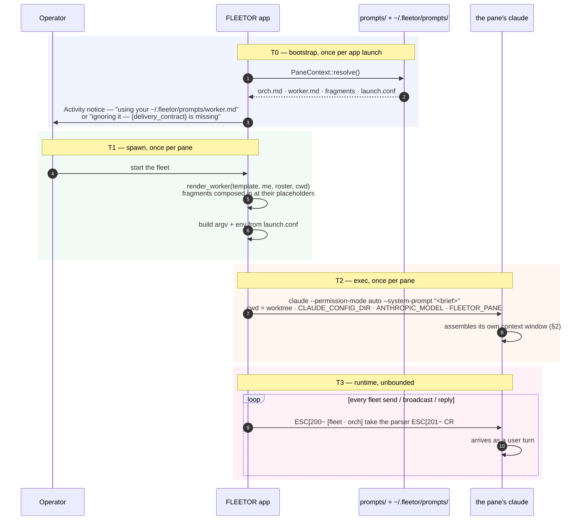
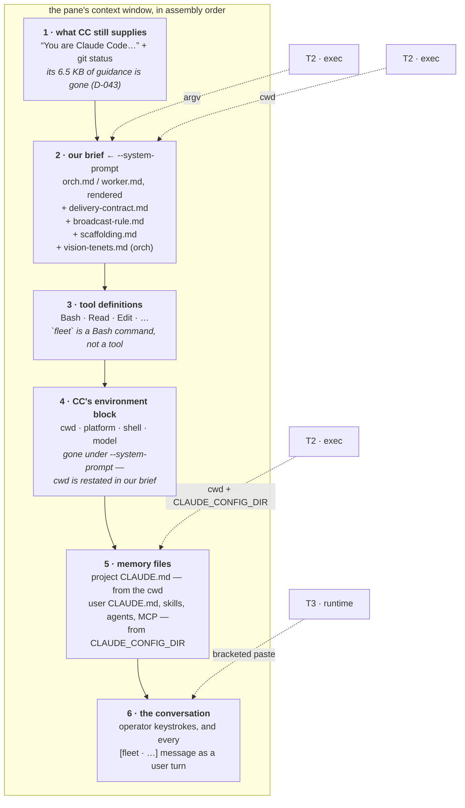
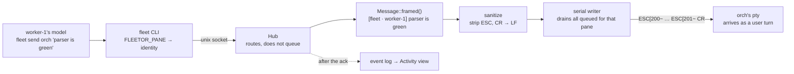

# When each piece of context is injected

The companion to [`prompts/README.md`](../prompts/README.md), which says *what* the files are. This one says **when each one arrives, and where it lands inside the pane's actual context window.**

The thing to hold onto: a pane is a real interactive `claude`, so everything here has to land in one of the four places `claude` accepts context — its system prompt, its memory files, its environment, or a user turn. There is no fifth door.

---

## 1. The timeline

Four moments. Only the last one repeats.

**Everything before T3 is frozen at `exec`.** There is no way to change a running pane's system prompt, so an edited `worker.md` reaches a pane on its *next* launch. That is the same rule `fleet_pick_target` follows for the target repo, and for the same reason.

---

## 2. Where it lands in the pane's context window

This is the part that matters when you are writing a brief: your text is not the only thing in there, and it does not arrive first.

Three consequences worth designing around:

**Our brief is a *replacement*, but a narrower one than that sounds (D-043).** `--system-prompt` empties Claude Code's guidance out of the system prompt — 6,866 chars down to 364 in the measured run — and leaves everything else exactly where it was. Tools, memory files, skills, agents and the git-status section are byte-identical under either flag; `docs/notes/system-prompt-notes.md` has the diff. Two consequences for anyone writing a brief: the line "You are Claude Code, Anthropic's official CLI for Claude." is its own system block and still arrives, so a brief saying "you are not Claude Code" contradicts the text above it; and the working posture that *did* leave has to come from `scaffolding.md`, which is why that fragment is composed into both briefs and cannot be dropped. A brief still cannot beat `--permission-mode` — that is a flag, not prose.

**Layer 5 stopped being where orch and worker diverge (D-062).** Until WP-14 the orchestrator ran on the operator's own `CLAUDE_CONFIG_DIR` and got their user `CLAUDE.md`, skills, subagents and MCP servers. It now runs on a fleet-owned config dir holding the same two onboarding keys a worker's does — the price of having its transcript archived with the run — so **neither class** gets any of that. Both still get the repo's own committed `CLAUDE.md`, because both have a checkout as their cwd. So a pane that needs to know something must be told it in its brief or in a file committed to the repo. There is no third place, for either of them now.

**Messages arrive as user turns, mid-conversation** — not as system context, and not at a turn boundary. That is why `broadcast-rule.md` exists: a user turn is exactly the thing a helpful model answers.

---

## 3. Every piece, and who owns it

| What | File / source | Lands in | When | Editable without a rebuild |
|---|---|---|---|---|
| Orchestrator brief | `prompts/orch.md` | system prompt (replace) | T2, once | ✅ `~/.fleetor/prompts/orch.md` |
| Worker brief (all 4 slots) | `prompts/worker.md` | system prompt (replace) | T2, once | ✅ `~/.fleetor/prompts/worker.md` |
| Exit-code contract | `prompts/delivery-contract.md` | inside both briefs | T2, once | ✅ — but the placeholder is required |
| Anti-amplification clause | `prompts/broadcast-rule.md` | inside the worker brief | T2, once | ✅ — but the placeholder is required |
| Working posture CC no longer supplies | `prompts/scaffolding.md` | inside both briefs | T2, once | ✅ — but the placeholder is required |
| The vision tenets | `prompts/vision-tenets.md` | inside the orchestrator brief | T2, once | ✅ — but the placeholder is required |
| The pane's working directory | the cwd `spawn.rs` sets | `{cwd}` in both briefs | T2, once | ❌ — CC's `# Environment` section used to carry it |
| Peer roster | computed — `PaneId::roster` | `{peers}` / `{workers}` | T2, once | ❌ `WORKER_SLOTS` |
| Worker model | `prompts/launch.conf` | `ANTHROPIC_MODEL` | T2, once | ✅ |
| Worker endpoint | `prompts/launch.conf` | `ANTHROPIC_BASE_URL` | T2, once | ✅ |
| Permission mode | `prompts/launch.conf` | `--permission-mode` | T2, once | ✅ |
| Worker credential | `DEEPSEEK_API_KEY` env or nearest `.env` | `ANTHROPIC_AUTH_TOKEN` | T2, once | ✅ (never in a file here) |
| Project memory | the target repo's own `CLAUDE.md` | memory files | T2, once | ✅ — it is just a repo file |
| Operator memory, skills, agents, MCP | `CLAUDE_CONFIG_DIR` | memory files | T2, once | **none, for either class** (D-062) |
| `orch`'s credential | the operator's Keychain entry | `CLAUDE_SECURESTORAGE_CONFIG_DIR=""` | T2, once | ❌ — unset it and orch is silently logged out |
| Pane identity | `FLEETOR_PANE` | env, read by `fleet` | T2, once | ❌ by design |
| Fleet messages | `fleetor-core::message` framing | a user turn | **T3, every send** | ❌ single-sourced |
| The three wedge-forever removals | `src-tauri/src/spawn.rs` | env | T2, once | ❌ documented in `launch.conf` |

---

## 4. The one runtime path, in detail

T3 is the only thing that repeats, and it is the only context a pane receives that it did not start with.

The framing is single-sourced in `fleetor-core::message` and cross-checked by a test in `brief.rs`, so the briefs can never describe a framing the delivery path no longer produces. That is why `[fleet · worker-3]` appears verbatim in `worker.md` — it is pinned, not decorative. If you rewrite the "What arrives" section, keep an example of both shapes in it.

For everything about how that message travels and what can go wrong on the way, see [`fleet-comms-map.md`](./fleet-comms-map.md).

---

## 5. Changing a brief, end to end

1. `cp prompts/worker.md ~/.fleetor/prompts/` and edit it. Keep paragraphs on one line, keep every placeholder.
2. Restart the fleet. Watch the Activity feed: an `Info` naming your file means it loaded; a `Warn` names the placeholder you dropped and tells you the built-in is running instead.
3. `cargo test -p fleetor-core` if you changed the shipped file rather than an override — the tests pin the verb list, both fragments and the framing.

To make a change permanent, edit `prompts/*.md` in the repo and commit it. The override directory is for iterating; the repo is for deciding.
