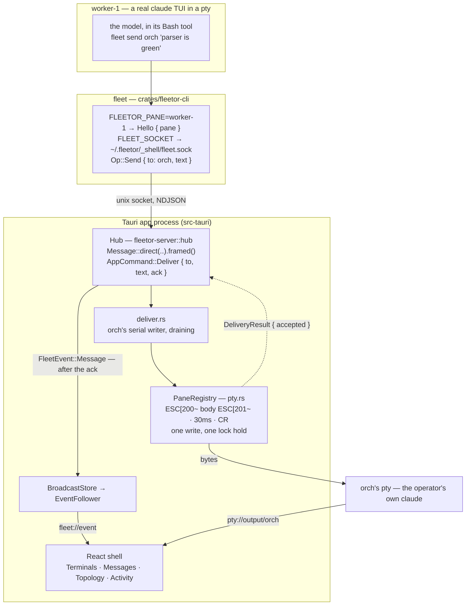

# How a message travels — as-built map

The one document to read before changing anything in the delivery path. It follows a single `fleet send` from the model that typed it to the terminal it lands in, and names what can go wrong at each step.

*Written against the post-pivot system (D-030). The previous version of this file mapped six channels, a sync/async supervisor split, an MCP shim, a mail queue and a ticket board — it was the input to the pivot, and all of that is deleted. This documents what the code **does**.*

---

## 1. The path, end to end



Two things about that diagram are load-bearing.

**The ack comes back before the log is written.** `Hub::deliver` asks the app, waits, and *then* appends. That ordering is the entire reason the app seam is request/response rather than fire-and-forget: the feed records the real outcome, never an intention. Reverse it and the Messages view starts claiming deliveries that did not happen.

**There is no timeout on that wait.** Not in the CLI, not in the hub, not in the delivery loop. A ceiling cannot cancel a delivery already sitting in the channel, so all it could do is report failure for a message that then arrives — the model resends, and the log lies. Waiting forever is the honest failure (D-034).

---

## 2. `fleet` — the agent surface

Five verbs: `send`, `broadcast`, `reply`, `roster`, `whoami`. It is a Bash command, not an MCP server, and that is deliberate — a model that can run `ls` can run `fleet send`, and it reads its own exit code and stderr, so a refusal is self-correcting in a way a tool result is not.

Identity comes from `FLEETOR_PANE`, set by the spawn path. There is no anonymous connection: `Hello` carries a `PaneId`, not an `Option<PaneId>`, so a message from nobody cannot be constructed. `fleet reply` routes on who last got through, which is only meaningful because of that.

Exit codes are a contract both briefs state verbatim: **non-zero means it did not arrive.** Zero means the bytes reached a live terminal, and explicitly not that anyone read them.

The wire tag *is* the verb — `Op::Send` serializes as `"send"` — so there is no second spelling to keep in sync. A test pins the clap subcommand list to `brief::VERBS`, because a rename landing in only one place teaches every pane a command that exits 2.

---

## 3. The hub — routing, and nothing else

It decides where a message goes and writes down what happened. It holds nothing. There is no queue, no mail table, no turn boundary, no ask/reply waiter, no long-poll — all of that existed to compensate for headless workers having no writable stdin between turns, and a live TUI is always writable. That single fact is what deleted roughly seven thousand lines.

`broadcast` fans out to the **app's** roster, not to a configured slot list: a fan-out should reach the panes that exist, not the panes someone once declared. It reports `accepted` only if *every* leg landed — the brief taught the model that zero means the bytes arrived, so a partial fan-out reading as a full one means the panes that missed it are never followed up.

A broadcast leg deliberately does **not** become the recipient's reply target. It was not addressed to them, the brief tells them not to answer it, and letting it overwrite `last_inbound_from` would silently redirect their next `fleet reply` to a pane that never spoke to them. That is the one failure where a message arrives somewhere it was never meant to go.

---

## 4. The registry — five ptys

One pty per pane, keyed by `PaneId`. Three properties matter.

**Per-pane event channels** (`pty://output/orch`, `pty://output/2`). Not one channel with an id in the payload. `AppHandle::emit` wakes *every* listener registered on a name, so a shared channel means all five panes' callbacks fire for every chunk from every pane and four of them discard it. Per-id names make cross-talk impossible rather than merely unlikely, and remove 5× the JS wakeups as a side effect.

**Coalesced reads.** `read()` returns as soon as any bytes are available, so a TUI's 200-byte spinner frame would otherwise make a complete trip across the IPC bridge — the event rate tracks the TUI's *repaint* rate, not its data rate. The pump merges ~16 ms or 64 KB before emitting. It is two threads, not one: a single thread could only check its window *after* the next blocking read returned, so the tail of a burst would sit unflushed until the pane happened to print again.

**One write, one lock.** The paste-open, body, paste-close and `\r` reach the pty under a single hold of that pane's writer mutex. Tauri dispatches sync commands on a thread pool, so an operator keystroke racing a delivery could otherwise land between a message's body and its submit — corrupting it or submitting it early.

---

## 5. The writer — one per pane, draining

Each pane has a single task that owns its terminal. When free it takes **everything** currently queued for that pane (`try_recv`, never `recv`) and sends it as one bracketed paste, each message still framed with its sender, separated by a blank line.

This exists because of something observed on a live fleet: several workers messaging the orchestrator at once, some getting lost. Two causes.

*Ours:* every `Deliver` used to get its own `spawn_blocking` task, and those raced for the writer lock in whatever order the blocking pool scheduled them. Nothing was dropped — the mutex and the kernel buffer see to that — but a pane could see messages in an order the log disagreed with.

*Not ours:* a `claude` input box is one text field. Message A submits and starts a turn; B's paste lands mid-turn and CC queues it; C lands on the same buffer. What the model reads is a blend.

The serial drain fixes the first outright and takes the second away from the TUI, doing the merge ourselves where the framing still says who sent what. It is **not** the batching this design bans: zero delay for a message arriving at a free pane, and it groups only what was already concurrent — the set the TUI was going to merge anyway. Every message keeps its own log row, its own `accepted` and its own ack. The batch groups the write, never the accounting (D-039).

---

## 6. What each agent actually receives

Two things, and nothing else.

**At spawn, a briefing** via `--system-prompt` (`fleetor-core::brief`) — never a `CLAUDE.md` in the pane's cwd, which would show up in `git status` and could be deleted by the worker itself. It names the peers, teaches the five verbs, states the exit-code contract verbatim, and shows the framing the pane will actually see. The worker brief additionally carries the L5 clause: *never reply to a broadcast unless it names you.*

**At runtime, framed messages** typed into its input:

```
[fleet · orch] take the parser, I have the CLI
[fleet · worker-1 → all] rebasing onto master
```

The two framings differ on purpose. A worker can only obey the do-not-answer-a-broadcast rule if it can see which kind arrived.

`message::sanitize` is a security boundary, not tidying. Delivery wraps the body in a bracketed paste, which makes it *data* only for as long as it contains no escape of its own — a body carrying `ESC[201~` would end the paste early and every byte after it would arrive as live keystrokes at a `claude` prompt, where `ESC` cancels and `/` opens a menu. CRLF and lone CR become newlines, tabs and newlines survive, every other control character is dropped. Dropped rather than rejected: a mangled message that lands beats a clean one that doesn't. The log keeps the raw body — sanitizing is a property of the pty boundary, not of the message.

---

## 7. What can go wrong, and how it shows

| Failure | How it presents | Where it is handled |
|---|---|---|
| Pane never spawned | `fleet send 2` exits 1, `worker-2 is not running` | `PaneRegistry::writable` |
| Pane has exited | exits 1, `worker-2 has exited` | same. The predicate is `accepts_input()`, i.e. **not dead** — never `is_live()`, because nothing tells us when `claude` reaches its prompt, and refusing on a guess means a healthy pane silently drops everything |
| App window closed | exits 1, `the fleet app is not accepting commands` | `Hub::ask_app` |
| App took it and never answered | exits 1, `treat it as not delivered` | same. A dropped ack would otherwise park the caller forever |
| **Pane is mid-turn** | **exits 0, `accepted`, and the model may never act on it** | **nothing on this side of the pty can see it.** The residual, and the reason `accepted` is the weaker claim (L3) |
| `fleet` not on PATH | panes spawn fine and cannot message; `Notice` on the Activity view at spawn | `spawn::fleet_bin_path` |
| Pane wedged on onboarding | looks exactly like a working pane; every send reports success | `spawn::seed_config_dir`, called at the spawn site so it is keyed by the cwd actually used |
| Body contains `ESC[201~` | would end the paste early and turn its tail into live keystrokes | `message::sanitize` |
| Worktree creation failed | `Warn` on Activity; that worker shares the target checkout | `fleet::worker_cwd` |

---

## 8. Reading the code

Follow it in this order; it is roughly the order the bytes travel.

1. `crates/fleetor-core/src/pane.rs` — identity, and why `accepts_input()` is not `is_live()`
2. `crates/fleetor-core/src/message.rs` — the record, the framing, `sanitize`
3. `crates/fleetor-core/src/brief.rs` — what each pane is told
4. `crates/fleetor-cli/src/main.rs` — the five verbs and the exit-code contract
5. `crates/fleetor-server/src/hub.rs` — routing, and persist-after-ack
6. `src-tauri/src/deliver.rs` — the serial drain
7. `src-tauri/src/pty.rs` — the registry, the channels, the read pump
8. `src-tauri/src/spawn.rs` — how a pane is launched

The two test files worth reading as documentation: `crates/fleetor-server/tests/pane_messaging.rs` (every routing decision, against a fake app) and `src-tauri/tests/panes.rs` (five real ptys, no tokens).
